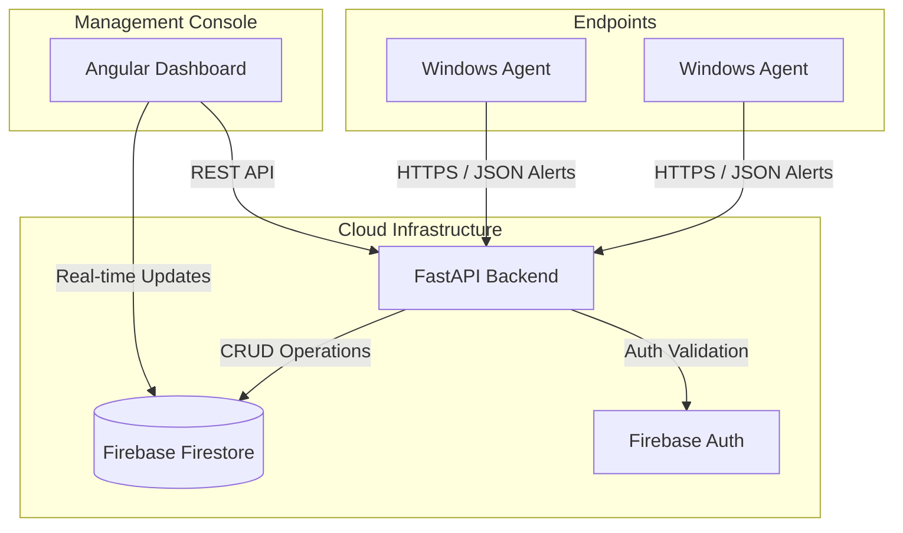

# TechzazEDR Dashboard

A modern, high-performance Endpoint Detection and Response (EDR) dashboard built with a decoupled architecture using Angular and FastAPI. It serves as the central orchestration and monitoring hub for the TechzazEDR ecosystem.

## Table of Contents
- [Overview](#overview)
- [Architecture](#architecture)
- [System Functions](#-system-functions)
- [Tech Stack](#tech-stack)
- [Project Structure](#project-structure)
- [Getting Started](#getting-started)
  - [Frontend Setup](#frontend-setup)
  - [Backend Setup](#backend-setup)
- [Git Workflow](#git-workflow)
- [API Documentation](#api-documentation)

---

## 🏗️ System Architecture

The TechzazEDR system consists of distributed Agents (C# .NET) that stream security telemetry to a central FastAPI Backend, which stores data in a multi-tenant Firestore structure, visualized by a real-time Angular Frontend.



### Multi-Tenant Data Isolation
The system is designed for massive scale and secure data isolation:
- **Hierarchical Pathing**: Data is stored at `organizations/{org_id}/agents/{agent_id}/alerts/{alert_id}`.
- **API Key Scoped**: Agents use unique `OrganizationApiKeys` to ingest data; the backend resolves these to internal `TenantIDs`.
- **RBAC**: Fine-grained access control (Admin, Analyst, Viewer, Service) enforced at the API layer.

## ⚙️ System Functions

The TechzazEDR ecosystem provides a comprehensive suite of security functions divided across its distributed components.

### 🛡️ Detection & Response (Agent Level)
- **Heuristic Process Analysis**: Continuously monitors process behavior to identify masquerading (e.g., system binaries running from `/Temp`).
- **Persistence Watchdog**: Scans and alerts on unauthorized changes to Windows Startup registry keys.
- **YARA-Powered Scanning**: Executes complex signature-base scans against the filesystem to detect known malware variants.
- **Network Protocol Analysis**: Live DPI (Deep Packet Inspection) to detect port scans, SYN floods, and DNS anomalies.

### 📊 Management & Orchestration (Backend Level)
- **Multi-Tenant Command Center**: Securely scales across multiple organizations with strict data isolation.
- **Agent Fleet Orchestration**: Monitors agent health, last-seen heartbeats, and online/offline status.
- **Alert Ingestion Pipeline**: Asynchronously processes incoming security telemetry to ensure low-latency response times.
- **Admin Workflow Management**: Advanced user invitation system with RBAC (Role-Based Access Control) and session revocation.

### 🖥️ Analytics & Visualization (Frontend Level)
- **Aggregated Security Overview**: Real-time high-level charts and metrics for rapid situational awareness.
- **Endpoint Forensic Explorer**: Deep-dive capabilities into specific agent history and active threat status.
- **Incident Investigation Lab**: Dedicated workflow for analyzing, triaging, and responding to detected threats.
- **Org-Level Security Posture**: Configuration of global detection policies and notification settings.

## 🛠️ Tech Stack

### Frontend
- **Framework**: [Angular](https://angular.io/) (v21+) with Signal-based state management.
- **Animations**: GSAP for ultra-smooth transitions.
- **Icons**: Lucide Angular.
- **Styling**: Modern SCSS following BEM and modular principles.

### Backend
- **Framework**: [FastAPI](https://fastapi.tiangolo.com/) (Asynchronous Python).
- **Database**: Google Cloud Firestore (NoSQL).
- **Authentication**: Firebase Authentication with JWT and Custom Claims.
- **Processing**: Background tasks for non-blocking alert ingestion.

---

## 📂 Project Structure

```text
TechzazEDR_Dashboard/
├── frontend/             # Angular 21 SPA
│   ├── src/app/
│   │   ├── core/         # Guards, Services, Interceptors
│   │   ├── dashboard/    # Main monitoring views (Overview, Endpoints, Alerts)
│   │   ├── settings/     # Org management & Profile
│   │   └── home/         # Marketing and Landing pages
│   └── package.json
├── backend/              # FastAPI REST API
│   ├── app/
│   │   ├── api/          # Functional routes (Alerts, Admin, Analytics)
│   │   ├── core/         # Firewall, Auth, Firebase Init
│   │   ├── models/       # Firestore Data Models
│   │   └── schemas/      # Pydantic validation schemas
│   ├── requirements.txt
│   └── run.py            # Entry point
└── README.md
```

---

## 🚀 Getting Started

### Prerequisites
- Node.js (v20+)
- Python (3.13+)
- Google Cloud Service Account (Firebase)

### Frontend Setup
1. `cd frontend`
2. `npm install`
3. `npm start` -> http://localhost:4200/

### Backend Setup
1. `cd backend`
2. `python -m venv .venv`
3. `source .venv/bin/activate` (or `.venv\Scripts\activate`)
4. `pip install -r requirements.txt`
5. `python initialize_orgs.py` (First time only)
6. `python run.py` -> http://127.0.0.1:8000/

---

## 🔒 Security & API Documentation

Access the interactive API docs at:
- **Swagger UI**: [http://127.0.0.1:8000/docs](http://127.0.0.1:8000/docs)
- **ReDoc**: [http://127.0.0.1:8000/redoc](http://127.0.0.1:8000/redoc)

## 🤝 Git Workflow

- `main`: Production-stable.
- `inuka`: Feature development.
