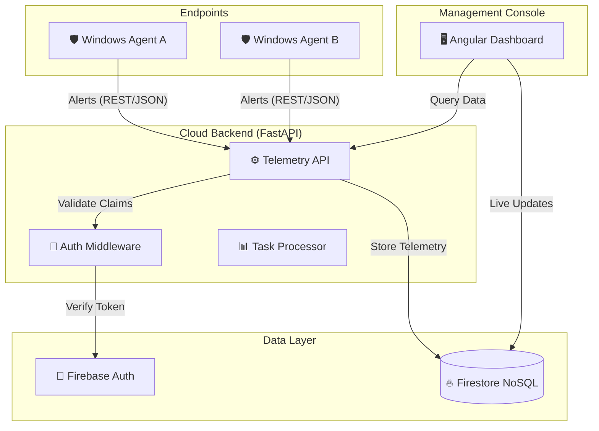
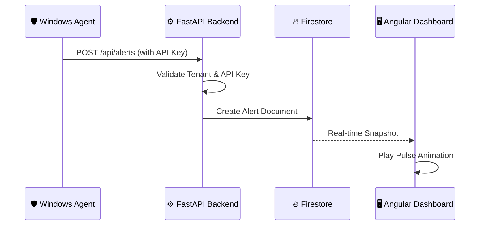

# 🛡️ TechzazEDR Dashboard

[](#)
[](#)
[](#)

A modern, high-performance Endpoint Detection and Response (EDR) orchestration hub. Built with a decoupled architecture using **Angular 21** and **FastAPI**, it provides real-time monitoring, threat hunting, and fleet management for the TechzazEDR ecosystem.

---

## 📖 Table of Contents
- [✨ Core Features](#-core-features)
- [🏗️ System Architecture](#️-system-architecture)
- [🛠️ Tech Stack](#️-tech-stack)
- [📂 Project Structure](#-project-structure)
- [🚀 Quick Start](#-quick-start)
- [🔒 Security](#-security)
- [🤝 Contributing](#-contributing)

---

## ✨ Core Features

| Feature | Description |
| :--- | :--- |
| **Real-time Monitoring** | Live telemetry streaming from agents directly to the dashboard. |
| **Multi-Tenant Hub** | Secure data isolation for multiple organizations and sub-tenants. |
| **Fleet Orchestration** | Monitor agent health, status, and orchestrate remote scans. |
| **Advanced Analytics** | High-fidelity visualizations for rapid threat triage and investigation. |
| **RBAC** | Fine-grained access control (Admin, Analyst, Viewer) at the API layer. |

---

## 🏗️ System Architecture

The TechzazEDR ecosystem follows a distributed telemetry pipeline:



### 🛰️ Telemetry Pipeline
1. **Detection**: Agents detect threats using HIDS, YARA, or Network DPI.
2. **Ingestion**: Alerts are pushed to the FastAPI backend via scoped API keys.
3. **Storage**: Data is stored in a hierarchical Firestore structure: `organizations/{org_id}/agents/{agent_id}/alerts/{alert_id}`.
4. **Visualization**: Analysts monitor and triage alerts in real-time on the dashboard.



---

## 🛠️ Tech Stack

### Frontend
- **Framework**: [Angular 21](https://angular.io/) (Signals, Standalone Components)
- **Styling**: Modern SCSS + Lucide Icons
- **Animations**: [GSAP](https://greensock.com/gsap/) for premium feel
- **Build**: Vite-powered CLI

### Backend
- **Framework**: [FastAPI](https://fastapi.tiangolo.com/) (Async Python 3.13)
- **Validation**: Pydantic v2
- **Database**: Google Cloud Firestore
- **Identity**: Firebase Authentication (Custom Claims)

---

## 📂 Project Structure

```text
TechzazEDR_Dashboard/
├── frontend/             # Angular 21 Single Page Application
│   ├── src/app/core/     # Global Services & Guards
│   ├── src/app/dashboard/# Overview, Endpoints, Incidents
│   └── src/app/settings/ # Org & Profile Management
├── backend/              # FastAPI REST API
│   ├── app/api/          # Route Handlers
│   ├── app/core/         # Security & Firebase Logic
│   └── app/models/       # Firestore Data Schemas
└── README.md             # Project Root Documentation
```

---

## 🚀 Quick Start

### 1. Clone the Repository
```bash
git clone https://github.com/Techzaz/TechzazEDR_Dashboard.git
cd TechzazEDR_Dashboard
```

### 2. Backend Setup
```bash
cd backend
python -m venv .venv
# Activate: source .venv/bin/activate (Linux/macOS) or .venv\Scripts\activate (Windows)
pip install -r requirements.txt
python initialize_orgs.py  # Seed initial tenant
python run.py              # Start API on http://localhost:8000
```

### 3. Frontend Setup
```bash
cd ../frontend
npm install
npm start                  # Start Console on http://localhost:4200
```

---

## 🔒 Security
- All API communication requires valid JWT tokens.
- Agents authenticate via `OrganizationApiKeys`.
- Data isolation enforced through Firestore security rules and backend validation.

## 🤝 Contributing
Contributions are welcome! Please branch from `main` and submit a Pull Request.

---
> [!NOTE]
> This system is designed for enterprise-grade security monitoring. Ensure your Firebase configuration is properly secured before deploying to production.
