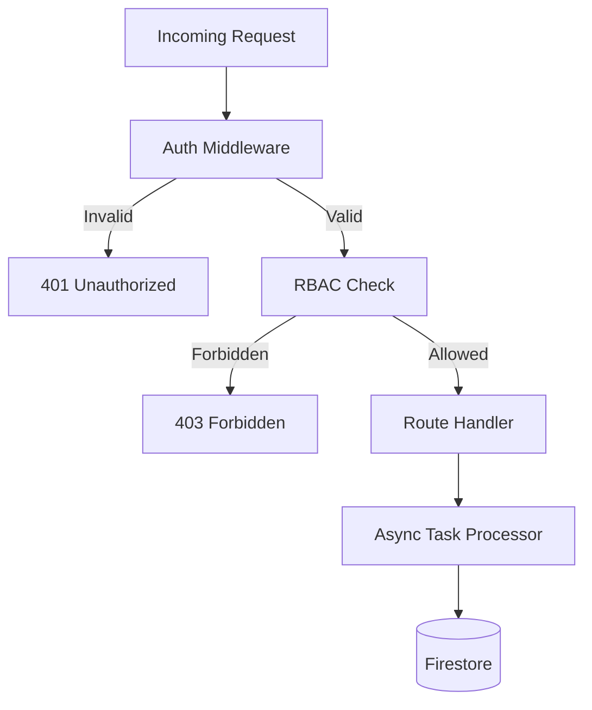

# ⚙️ TechzazEDR Backend API

[](#)
[](#)

The TechzazEDR Backend is a high-performance, asynchronous REST API built with **FastAPI**. It serves as the central brain of the ecosystem, handling telemetry ingestion, multi-tenant orchestration, and administrative workflows.

---

## 🚀 Key Responsibilities

- **Alert Ingestion**: Secured endpoint for agents to push telemetry securely.
- **Organization Management**: Multi-tenant isolation and tenant provisioning.
- **RBAC (Role-Based Access Control)**: Managing users through Firebase Auth Custom Claims.
- **Audit Logging**: Tracking sensitive administrative actions across the fleet.
- **Real-time Synchronization**: Bridging the gap between .NET Agents and the Angular Frontend.

---

## 📦 Module Functions

### 🔌 Alerts Module (`app/api/alerts.py`)
- **Telemetry Ingestion**: Highly optimized POST endpoint for agent alert streaming.
- **Background Processing**: Queues alerts for non-blocking persistence to Firestore.
- **Agent Pulse**: Automatically updates `last_seen` and `status` of agents upon data receipt.

### 🛡️ Admin Module (`app/api/admin.py`)
- **User Invitation Engine**: Manages the lifecycle of user invitations and registrations.
- **RBAC Orchestration**: Dynamically assigns roles (Admin, Analyst, Viewer) via Custom Claims.
- **Session Control**: Instant session revocation and account disabling.



---

## 🛠️ Utility Scripts

The backend includes several scripts for administration and testing:

| Script | Purpose |
| :--- | :--- |
| `initialize_orgs.py` | Bootstraps the initial organization and demo tenants. |
| `bootstrap_admin.py` | Creates a super-admin user in Firebase. |
| `sync_users.py` | Synchronizes local user data with Firebase Auth. |
| `inject_alert.py` | Simulates an agent pushing an alert for testing purposes. |
| `list_agents.py` | Lists all registered agents for a specific tenant. |
| `verify_last_seen.py` | Checks agent heartbeats and updates connectivity status. |

---

## 🏗️ Technical Architecture

### Data Model (Firestore)
```text
organizations/
  └── {tenant_id}/
      ├── agents/
      │   └── {agent_id}/
      │       ├── last_seen
      │       ├── status
      │       └── alerts/
      │           └── {alert_id}/
      │               ├── RuleId
      │               ├── Category
      │               └── Severity
users/
  └── {uid}/
      ├── email
      ├── tenantId
      └── role
```

---

## ⚙️ Configuration

Copy `.env.example` to `.env` and configure:

| Variable | Description | Default |
|:---|:---|:---|
| `PROJECT_NAME` | Display name of the API | Techzaz EDR Dashboard |
| `FIREBASE_SERVICE_ACCOUNT_PATH` | Path to JSON key | `firebase-service-account.json` |
| `FIREBASE_PROJECT_ID` | Firebase Project ID | `techzazedr` |
| `ALERTS_API_KEY` | Global/Default Ingestion Key| `tz_demo_key` |

---

## 🧪 Setup & Development

1. **Environment**:
   ```bash
   python -m venv .venv
   .venv\Scripts\activate  # Windows
   pip install -r requirements.txt
   ```

2. **Firebase**:
   Place `firebase-service-account.json` in this directory.

3. **Initialize**:
   ```bash
   python initialize_orgs.py
   ```

4. **Run**:
   ```bash
   python run.py
   ```

---

## 📑 API Documentation
- **Swagger UI**: [http://127.0.0.1:8000/docs](http://127.0.0.1:8000/docs)
- **ReDoc**: [http://127.0.0.1:8000/redoc](http://127.0.0.1:8000/redoc)

---
> [!IMPORTANT]
> Ensure strictly scoped service account permissions for production deployments.
