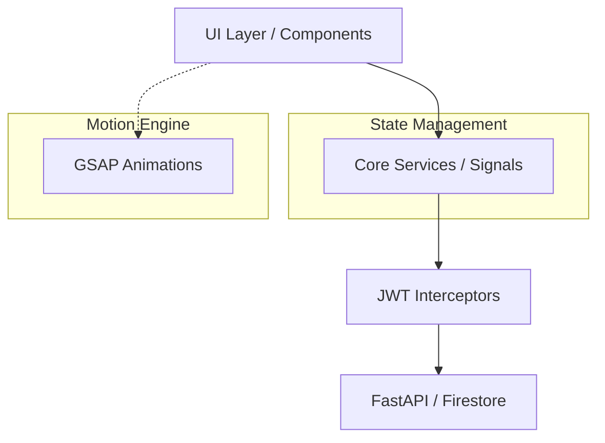

# 🖥️ TechzazEDR Management Console

[](#)
[](#)
[](#)

A premium, high-fidelity security operations console. This dashboard provides real-time threat visualization and fleet management with a focus on speed, performance, and user experience.

---

## ✨ Key Features

- **Signal-Based Reactivity**: Utilizing Angular's newest reactivity model for lightning-fast UI updates.
- **GSAP-Powered UX**: Ultra-smooth micro-animations for a premium, "Defense Grade" feel.
- **Real-time Alert Streams**: Direct Firestore integration for zero-latency detection updates.
- **Multi-Tenant Navigation**: Context-aware switching between organizations and tenants.
- **Responsive Command Center**: Optimized for desktop monitoring and tablet field use.

---

## 🗺️ Dashboard Views

| View | Purpose | Features |
| :--- | :--- | :--- |
| **Overview** | Situational Awareness | Real-time charts, Top Threat lists, Fleet health. |
| **Endpoints** | Fleet Management | Searchable agent table, detail drill-downs, status tracking. |
| **Incidents** | Investigation Lab | Advanced filtering, side-pane previews, triage actions. |
| **Settings** | Configuration | API key management, Org profile, RBAC profile. |

---

## 🏗️ Technology Stack

- **Core**: Angular 21 (Standalone Components)
- **Reactivity**: Angular Signals
- **Motion**: GSAP 3 (GreenSock)
- **Icons**: Lucide Angular
- **State Management**: Service-based Signal stores
- **Build**: Vite-powered CLI



---

## 📂 Project Structure

```text
src/app/
├── core/             # Auth, API Services, Guards, Interceptors
├── dashboard/        # Feature Modules (Overview, Endpoints, Incidents)
│   ├── overview/     # Aggregated security charts
│   ├── endpoints/    # Fleet monitoring and agent management
│   └── incidents/    # Alert investigation and triage
├── settings/         # Organization & Profile configuration
├── shared/           # UI Components (Buttons, Modals, Cards)
└── home/             # Landing and Entry views
```

---

## 🚀 Getting Started

### 1. Installation
```bash
npm install
```

### 2. Development
```bash
npm start
```
*Console will be live at http://localhost:4200/*

### 3. Production Build
```bash
npm run build
```

---

## 🎨 UI/UX Guidelines
- Use **GSAP** for all state transitions (sidebar, card loading, alert pulses).
- Favor **Signals** over `BehaviorSubject` for local component state.
- Follow the modular SCSS structure in `src/styles/` for new components.

---
> [!TIP]
> Check the `video/` directory in the repository root for visual walkthroughs of new UI features.